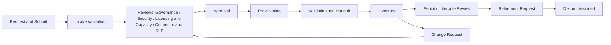

# 01. Overview, Assumptions, and Personas

Covers deliverables 1 (executive summary), 2 (assumptions and unresolved decisions), and 3 (personas and stakeholder matrix).

## 1. Executive solution summary

The **Power Platform Environment Request and Governance Tracker** is a Dataverse-backed model-driven app that runs the full lifecycle of a Power Platform environment, from request to retirement, and keeps the audit evidence.

| Concern | Design response |
|---|---|
| Federated operating model | A central platform team owns guardrails. Organizations own apps, data, integrations, support, and mission outcomes. Routing rules delegate routine decisions and escalate risk. |
| Reuse by any DoD or federal organization | No organization-specific value is hard-coded. An **Organization Configuration** record plus reference tables and environment variables define names, boundaries, classifications, families, rules, DLP, connectors, cadences, naming, request-number format, and notifications. USMC ships only as a seed package. |
| Request vs. Environment | `Environment Request` and `Provisioned Environment` are separate. One request yields zero, one, or many environments. Later changes use linked `Environment Change Request` records and never overwrite the original intake decision. |
| Normalized model | People, organizations, stages, connectors, integrations, reviews, decisions, tasks, and lifecycle activities are related tables (38 in total). |
| Simple upfront request | The requestor answers 10 plain-language items and explains what they are trying to accomplish. Classification, licensing, connector risk, security requirements, authorization, and support planning are derived by rules or collected by the platform team and reviewers during intake and review. See [03a-requestor-intake.md](03a-requestor-intake.md). |
| Rules recommend, humans decide | Classification, connector, and architecture rules produce recommendations, required reviews, warnings, and escalation tasks. Nothing is auto-approved or auto-rejected. |
| Evidence | Documents live in SharePoint. Dataverse stores metadata, status, relationships, links, history, and audit. |
| Government cloud | Feature availability in GCC High, DoD, and IL5 is never assumed. See [10-alm-govcloud.md](10-alm-govcloud.md). |
| Delivery | Layered managed solutions, manual-first provisioning with an automation-ready task model, and a staged MVP. |

### Lifecycle at a glance

## 2. Assumptions and unresolved governance decisions

### Assumptions

| # | Assumption |
|---|---|
| A1 | The app runs in a Dataverse environment inside the implementing organization's authorized cloud boundary. |
| A2 | Users authenticate through Microsoft Entra ID. Users are Dataverse system users or are represented by Contacts for non-licensed stakeholders. No separate personnel database is built. |
| A3 | Supporting documents are stored in SharePoint and linked from Dataverse. |
| A4 | Provisioning is manual in the MVP. Provisioning Tasks are shaped so API automation can be added later per task. |
| A5 | License names, entitlements, DLP policy names, and connector classifications are reference data owned by the organization. |
| A6 | Actual environments are created outside the app (Power Platform admin center or approved tooling). The app records and tracks them. |
| A7 | The request-number sequence is generated server-side and is immutable after creation. |

### Unresolved governance decisions (implementing organization must decide)

| # | Decision | Owner (role) | Needed by |
|---|---|---|---|
| D1 | Which approval authorities exist, and delegation thresholds for each | Governance board | Before MVP configuration |
| D2 | Which reviews are mandatory per application and data classification combination | Governance board, security authority | Before MVP configuration |
| D3 | Review cadence per environment family and classification | Governance board | Before lifecycle review build |
| D4 | SLA and service-level targets for each review and stage | Central platform team | Before dashboards and escalation |
| D5 | High-risk connector definition and list | Security and DLP reviewers | Before connector register seeding |
| D6 | Whether environment families and types are fixed or extensible by organizations | Central platform team | Before reference-data design is final |
| D7 | Records-retention policy and periods for requests, evidence, and audit | Records manager | Before retention design |
| D8 | Whether Program Core indicator thresholds are scored or checklist-based | Enterprise architecture | Before rule build |
| D9 | Whether one deployment serves multiple organizations (multi-tenant data separation via business units) or one deployment per organization | Central platform team | Before security-role build |
| D10 | Which Dataverse environment hosts the app (and its own governance as a Production system) | Central platform team | Before ALM |
| D11 | Authoritative source for environment inventory (the app, tenant admin data, or both) | Central platform team | Before inventory build |
| D12 | SharePoint document structure and library permissions model | Records manager, platform team | Before document integration |
| D13 | Wording and values of the impact question and its mapping to application classification | Governance board | Before intake configuration |
| D14 | Mapping of each data-type option to a minimum data classification and to review triggers | Governance board, security authority | Before intake configuration |
| D15 | Whether "I don't know" on data type pauses review generation until intake confirms (recommended) or defaults to the strictest path | Governance board | Before rule build |
| D16 | Requestor-visible wording for statuses and returned questions | Central platform team | Before app build |

## 3. Personas and stakeholder matrix

| Persona | Typical title (configurable) | Goals | Primary app areas |
|---|---|---|---|
| Requestor | Maker, developer, program staff | Submit a simple 10-item request and track it. Is not expected to understand classification, licensing, or authorization | My Work |
| Business Owner | Program or business lead | Accept accountability for need and funding, approve own-organization items | My Work, Approvals |
| Technical Owner | App architect, lead developer | Accept technical accountability and handoff | My Work, Environment Inventory |
| Data Owner | Data steward | Approve use of governed data | My Work, Retirement |
| Command or Program Reviewer | Organization-level reviewer | Validate mission need and organizational priority | Intake and Review |
| Licensing and Capacity Reviewer | License and capacity manager | Confirm entitlement, funding, capacity | Intake and Review |
| Security Reviewer | Security authority staff (terminology configurable) | Assess authorization boundary and security posture | Intake and Review |
| Connector and DLP Reviewer | DLP policy owner | Assess connectors, integrations, and DLP fit | Intake and Review |
| Platform Intake Analyst | Central team intake staff | Validate completeness and route | Intake and Review |
| Platform Provisioner | Central team engineer | Execute provisioning tasks and validation | Provisioning |
| Platform Administrator | Central team lead | Manage configuration and app administration | Administration |
| Governance Board Reviewer | Board member | Decide escalated requests and exceptions | Approvals |
| Auditor or Read-Only Reviewer | Auditor, inspector | Inspect evidence and history | Governance, read-only |
| Support Personnel | Service desk, sustainment staff | Look up owners, runbooks, escalation paths | Environment Inventory |

### RACI by lifecycle capability

R = responsible, A = accountable, C = consulted, I = informed.

| Capability | Requestor | Bus. Owner | Tech. Owner | Data Owner | Cmd/Prog Reviewer | Intake Analyst | Security | Licensing | Connector/DLP | Governance Board | Provisioner | Platform Admin |
|---|---|---|---|---|---|---|---|---|---|---|---|---|
| Create and submit request | R | A | C | C | I | I | | | | | | |
| Intake validation | C | I | | | | R/A | | | | | | |
| Command/program review | I | C | | | R/A | I | | | | | | |
| Security and authorization review | C | I | C | C | | I | R/A | | | C | | |
| Licensing and capacity review | C | C | | | | I | | R/A | | | | |
| Connector and DLP review | C | | C | | | I | C | | R/A | C | | |
| Approval decision (standard) | I | I | | | C | R | | | | | | A |
| Approval decision (escalated) | I | I | | | C | C | C | C | C | R/A | | |
| Provisioning | I | I | C | | | | | | | | R | A |
| Validation and handoff | I | A | A | | | | | | | | R | C |
| Periodic lifecycle review | | A | R | C | C | | C | C | C | I | | R |
| Retirement | R | A | A | A | C | I | C | | | I | R | A |
| Configuration administration | | | | | | | | | | C | | R/A |
