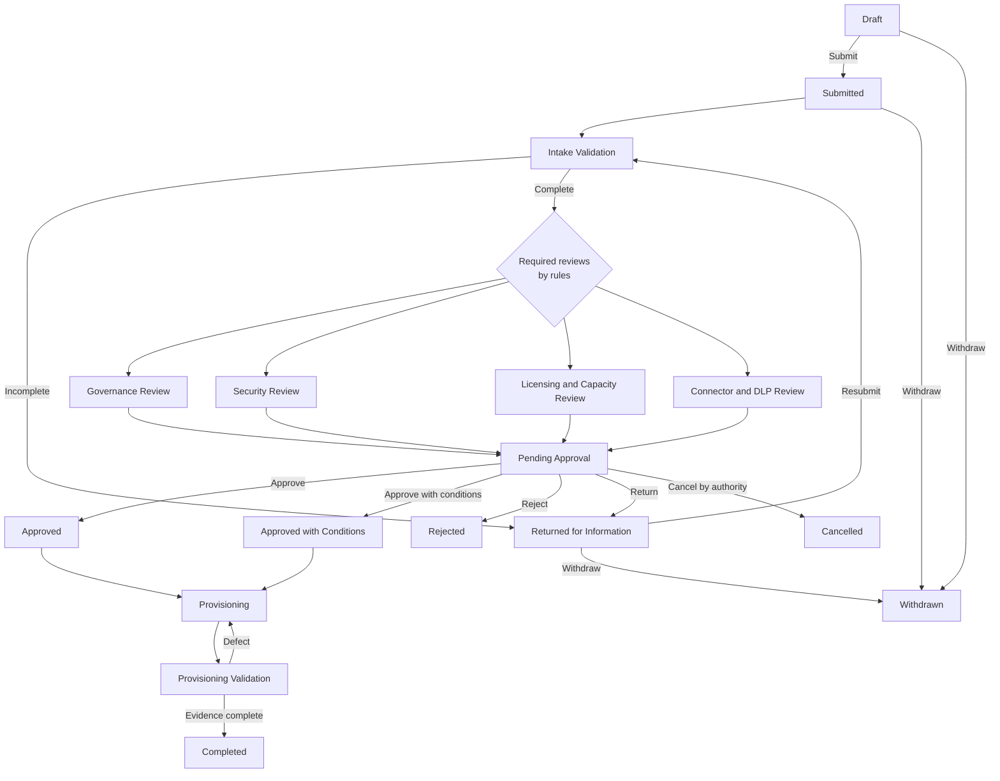
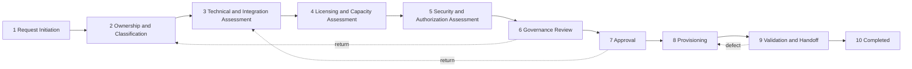

# 03. Process, Status Model, and Business Process Flow

Covers deliverables 6 and 7.

## 6. End-to-end process and status model

Reviews run in parallel after intake validation, according to the review rules. They are not a fixed sequence.

### Request status and status reason

Use the Dataverse **State** (Active / Inactive) with a **Status Reason** (`statuscode`) as the request status. The values below are recommended and the display labels are configurable only through a solution update, because logic depends on them.

| State | Status reason | Meaning | Set by |
|---|---|---|---|
| Active | Draft | Being prepared by requestor | System on create |
| Active | Submitted | Submitted, awaiting intake | Requestor (submit action) |
| Active | Intake Validation | Platform intake checking completeness and routing | Intake analyst |
| Active | Returned for Information | Awaiting requestor response | Intake analyst, reviewer, or approver |
| Active | Governance Review | Governance review in progress | System (review generation) |
| Active | Security Review | Security review in progress | System |
| Active | Licensing and Capacity Review | Licensing and capacity review in progress | System |
| Active | Connector and DLP Review | Connector and DLP review in progress | System |
| Active | Pending Approval | All required reviews complete, awaiting decision | System |
| Active | Approved | Approved without conditions | Decision record (authority) |
| Active | Approved with Conditions | Approved, with open conditions | Decision record (authority) |
| Active | Provisioning | Provisioning tasks in progress | System on task generation |
| Active | Provisioning Validation | Validation checklist in progress | Provisioner |
| Inactive | Completed | Environment records and validation evidence exist, handoff accepted | System guarded by rule |
| Inactive | Rejected | Rejected with rationale | Decision record |
| Inactive | Withdrawn | Withdrawn by requestor | Requestor |
| Inactive | Cancelled | Cancelled by authority or system | Authority |

### Parallel review status vs. request status

Because several reviews run concurrently, the request status reason shows the **primary active stage**. A **Review Summary** is shown through a subgrid of Governance Review records with their own status. The request status reason is not the source of truth for any individual review.

Rule: while any required review is open, the request status reason is the highest-priority open review type, with priority order Security, Connector and DLP, Licensing and Capacity, Governance. When all required reviews are complete and none is open, the status moves to Pending Approval.

### Status-transition rules

| From | To | Condition | Rationale required |
|---|---|---|---|
| Draft | Submitted | Submission validation passes | No |
| Submitted | Intake Validation | Intake analyst accepts | No |
| Intake Validation | Returned for Information | Missing or invalid information | Yes |
| Returned for Information | Intake Validation | Requestor resubmits | No |
| Intake Validation | Governance, Security, Licensing and Capacity, or Connector and DLP Review | Intake analyst has confirmed data classification, application classification, and environment family, and unknown answers are resolved. Reviews are then generated by rules | No |
| Any review status | Pending Approval | All required review records Complete | No |
| Pending Approval | Approved, Approved with Conditions, Rejected, Returned for Information | Decision recorded by authorized approver who is not the requestor | Yes for Rejected and Returned. Conditions and a review or expiration date for Approved with Conditions |
| Approved or Approved with Conditions | Provisioning | Provisioning tasks generated | No |
| Provisioning | Provisioning Validation | All required non-validation tasks complete | No |
| Provisioning Validation | Completed | Environment records exist, validation evidence exists, owners accept handoff | No |
| Draft, Submitted, Returned for Information | Withdrawn | Requestor withdraws | Yes |
| Any active non-terminal | Cancelled | Authorized cancel | Yes |

Terminal statuses: Completed, Rejected, Withdrawn, Cancelled. A rejected request may be resubmitted as a **new** request that references the earlier one (a `PriorRequest` lookup). Rejected records are not reopened.

## 7. Business Process Flow design

BPF name: **Environment Request Lifecycle** (`ppg_environmentrequestflow`) on `Environment Request`.

Stage design principles:
- Stages guide the user and enforce required fields at stage exit. Status reason and review records remain the source of truth.
- Stage required fields are limited to information already on the request. Child-record requirements (for example, at least one Requested Environment) use business rules, plug-in validation on stage change, or a validation action rather than BPF required fields.
- Conditional stage content depends on request attributes (for example, data classification, integration present).

### Stage 1: Request Initiation

The requestor completes the 10-item request ([03a-requestor-intake.md](03a-requestor-intake.md)). This is the only stage the requestor must understand.

| Item | Design |
|---|---|
| Required fields | Title, program or command, business justification and intended use, business owner, technical owner, data types, estimated user population, capabilities, connects to other systems (with systems summary if yes), workload type, duration type (with end date if temporary). "I don't know", "Not sure", and "Unknown" are valid answers |
| Conditional fields | Systems or services summary (if connects to other systems), expected end date (if temporary), authorization-boundary question (if data types or integration warrant), Data Owner (if data types indicate governed or sensitive data), prior request (if resubmission), related environment (if change) |
| Responsible role | Requestor |
| Entry criteria | New request in Draft |
| Exit criteria | All 10 items answered. Submission validation passes |
| Automated activities | Request-number generation, recommended data classification, recommended family, capability-derived flags, requestor and owner stakeholder assignments |
| Human decision points | Requestor decides to submit |
| Return conditions | Not applicable |
| Escalation | Not applicable. Escalation flags are derived after intake |

### Stage 2: Ownership and Classification

Completed by the platform intake analyst with the business owner. The requestor is not asked to classify.

| Item | Design |
|---|---|
| Required fields | Confirmed data classification, confirmed application classification, confirmed environment family, confirmed program and organization |
| Conditional fields | Impact answer (from business owner or intake), Data Owner (required when governed data), security point of contact (when security review is triggered), authorization boundary (when known) |
| Responsible role | Platform intake analyst (confirms). Business owner (impact answer, accountability). Requestor (answers questions) |
| Entry criteria | Request Submitted and accepted for Intake Validation |
| Exit criteria | Classifications and family confirmed, or request returned for information. Unknown answers resolved. Reviews generated by rules |
| Automated activities | Classification recommendation, effective-rank evaluation (most restrictive controls), family recommendation, required-review preview, warnings for not-supported classification, generation of Requested Environment stage records from the confirmed family |
| Human decision points | Intake analyst confirms or changes each recommendation, with triage notes for any change. Business owner confirms accountability |
| Return conditions | Unknown answers that intake cannot resolve, ownership gaps. Returns to the requestor with a specific question |
| Escalation | Not-supported data classification routes to a human decision. High-impact classification sets escalation flags |

### Stage 3: Technical and Integration Assessment

| Item | Design |
|---|---|
| Required fields | Application or workload (created or matched here). Support and sustainment plan started (required before Production approval, not before submission) |
| Conditional fields | Requested connectors (when the requestor named them or intake identified a need), external integrations (when the requestor answered Yes or Not Sure to connecting to another system), Program Core indicators (for Program family), AI or agent capability flag (derived from capability selection) |
| Responsible role | Technical owner, with the platform intake analyst. Connector risk is assessed by the Connector and DLP reviewer |
| Entry criteria | Stage 2 complete |
| Exit criteria | Connector and integration records exist when indicated. Program Core indicators answered. Support plan started |
| Automated activities | Connector risk lookup against Connector register, Program Core recommendation, flag high-risk or custom connector, external-facing, AI |
| Human decision points | Technical owner confirms assessment |
| Return conditions | Reviewer finds incomplete connector or integration data |
| Escalation | High-risk connector, custom connector, external-facing capability, AI with mission or sensitive data, enterprise architecture exception, cross-program shared data integration |

### Stage 4: Licensing and Capacity Assessment

| Item | Design |
|---|---|
| Required fields | Licensing requirement record and capacity estimate for each Dataverse environment |
| Conditional fields | Premium capability details, license funding owner, capacity allocation requirement |
| Responsible role | Licensing and capacity reviewer leads. Technical owner supplies scale input. The requestor is not asked for licensing detail |
| Entry criteria | Stage 3 complete |
| Exit criteria | Licensing and capacity records complete. Review requirement generated if premium or Dataverse |
| Automated activities | Licensing and capacity review generation based on rules |
| Human decision points | Licensing and capacity reviewer outcome |
| Return conditions | Estimates missing or inconsistent |
| Escalation | Capacity above organization-configured threshold, unfunded license need |

### Stage 5: Security and Authorization Assessment

| Item | Design |
|---|---|
| Required fields | Authorization boundary (existing or new) and security requirement record for sensitive-data requests |
| Conditional fields | CUI, PII, mission-data indicators, break-glass, service principal, service-account exception, production access model |
| Responsible role | Security reviewer leads. Technical owner supplies information. The requestor describes data and use case only, and the reviewer determines the applicable controls |
| Entry criteria | Stage 4 complete. Security review required by rules |
| Exit criteria | Security review complete when required. Unresolved findings documented |
| Automated activities | Security review generation, secret-pattern check on free text |
| Human decision points | Security reviewer outcome |
| Return conditions | Authorization information incomplete |
| Escalation | New or changed authorization boundary, break-glass, service-account exception, IL5-designated environment |

### Stage 6: Governance Review

| Item | Design |
|---|---|
| Required fields | Governance review record with reviewer and recommendation |
| Conditional fields | Exception record if a policy exception is sought |
| Responsible role | Command or program reviewer, platform intake analyst, governance board reviewer where escalated |
| Entry criteria | Stage 5 complete. All required reviews other than governance are complete or in a status that allows parallel completion per rules |
| Exit criteria | Governance review complete. Approval routing determined |
| Automated activities | Approval-rule evaluation (decision authority) and approver assignment |
| Human decision points | Governance recommendation |
| Return conditions | Reviewer requests more information |
| Escalation | Triggers listed in the approval-routing matrix |

### Stage 7: Approval

| Item | Design |
|---|---|
| Required fields | Approval Decision (authority, approver, decision, date, rationale) |
| Conditional fields | Conditions and expiration (for conditional approvals), related exception, evidence links |
| Responsible role | Delegated platform authority or governance board, as routed |
| Entry criteria | All required reviews complete. Support plan present if Production requested |
| Exit criteria | Decision recorded. Approver is not the requestor |
| Automated activities | Notifications, conditional-approval tracking records |
| Human decision points | Approve, approve with conditions, reject, return for information, withdraw, cancel |
| Return conditions | Return for information moves back to Stage 3 (or the stage named by the decision) |
| Escalation | Delegated authority escalates to governance board if a trigger applies |

### Stage 8: Provisioning

| Item | Design |
|---|---|
| Required fields | Provisioning tasks generated and assigned |
| Conditional fields | Automation dependency flag for API-based tasks |
| Responsible role | Platform provisioner |
| Entry criteria | Request is Approved or Approved with Conditions. Open pre-provisioning conditions satisfied |
| Exit criteria | All required provisioning tasks complete. Provisioned Environment records created and linked |
| Automated activities | Provisioning task generation from template, naming-standard application, sequencing so Production tasks wait for Test validation |
| Human decision points | Provisioner marks tasks complete with evidence |
| Return conditions | Not applicable |
| Escalation | Overdue task escalation |

### Stage 9: Validation and Handoff

| Item | Design |
|---|---|
| Required fields | Validation checklist results, evidence links, owner acceptance |
| Conditional fields | Managed Environment checks, pipeline checks, service principal checks |
| Responsible role | Provisioner (validates), business and technical owners (accept) |
| Entry criteria | Provisioning complete |
| Exit criteria | All validation checks pass or are accepted with an exception. Business and technical owners accept |
| Automated activities | Validation reminders, handoff notification |
| Human decision points | Owner acceptance |
| Return conditions | Failed validation returns to Stage 8 |
| Escalation | Validation unresolved past the organization-configured period |

### Stage 10: Completed

| Item | Design |
|---|---|
| Required fields | None additional. Completion is guarded |
| Responsible role | System |
| Entry criteria | Provisioned Environment records exist, validation evidence exists, ownership recorded, support and runbook locations recorded |
| Exit criteria | Terminal |
| Automated activities | Status set to Completed, inventory registration, lifecycle-review scheduling, closing notification |
| Human decision points | None |

### Stage-gating technique

| Mechanism | Used for |
|---|---|
| BPF required fields | Single-table fields on the request |
| Business rules | Field visibility, requiredness by classification or family |
| Synchronous plug-in (pre-operation) | Cross-record checks (child record existence, separation of duties, Test-before-Production, completion guard) |
| Custom action or command-bar function | Submission validation with a readable list of failures |
