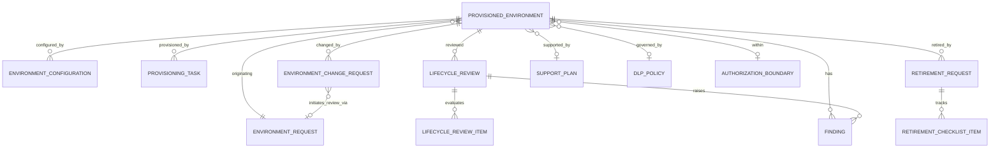
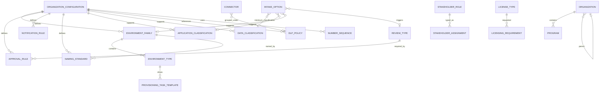

# 04. Dataverse Data Model (index, conventions, ER)

Covers deliverable 8 (entity-relationship model). The column dictionary (deliverable 9) is split by domain, and the relationship matrix (deliverable 10) is in [relationships.md](relationships.md).

| File | Contents |
|---|---|
| [config-reference.md](config-reference.md) | Configuration and reference tables |
| [request.md](request.md) | Request, stakeholders, application, connectors, integrations, licensing, security, support, documents, history |
| [review-approval.md](review-approval.md) | Reviews, review requirements, approval decisions, exceptions |
| [provisioning-lifecycle.md](provisioning-lifecycle.md) | Provisioning, inventory, configuration, lifecycle review, findings, change, retirement |
| [relationships.md](relationships.md) | Relationship matrix |

## Conventions

| Item | Convention |
|---|---|
| Publisher prefix | `ppg` (Power Platform Governance), customization prefix `ppg_`. Prefix is a placeholder and may be changed before the first solution is created. After that it cannot change. |
| Schema names | `ppg_<singularlowercase>`. Columns `ppg_<lowercase>`. Lookup columns end in `id` at schema level (for example `ppg_organizationid`). |
| Primary name | `ppg_name` (Single Line of Text) unless noted. |
| Data types | Dataverse types: Single Line of Text (Text), Multiple Lines of Text (Memo), Whole Number, Decimal Number, Floating Point Number, Currency, Date Only, Date and Time, Choice, Choices, Yes/No (Two Options), Lookup, Autonumber, URL (Text with URL format), Email (Text with Email format). |
| Choice columns | Local Choice unless it is shared, then Global Choice. Config-driven value sets use a reference table with a lookup, not a Choice. Fixed behavioral values (statuses, severities, decision types) use Choices because logic depends on them. |
| Ownership | **User or team owned** for transactional data (so Business Unit scoping and sharing apply). **Organization owned** for configuration and reference data (read widely, write by administrators). |
| System columns | Every table also has the standard system columns (`createdon`, `createdby`, `modifiedon`, `modifiedby`, `ownerid` where user/team owned, `owningbusinessunit`, `statecode`, `statuscode`). They are not repeated per table. |
| Required | "Req" = Business Required unless noted. System-generated values are set by plug-in or flow. |
| Sensitivity | Column security profiles are recommended for the columns marked **CS**. |
| Audit | Auditing is enabled at table level and on listed columns. Audit logs are not a replacement for history tables (see [../09-audit-reporting.md](../09-audit-reporting.md)). |
| Retention | Retention considerations follow the organization's records-retention policy referenced in Organization Configuration. Periods are not invented here. |
| Alternate keys | Defined for configuration and reference tables to support seed-data upsert and integration. |
| No secrets | No column stores secrets, passwords, certificates, keys, or tokens. Text columns that may attract them carry guidance and pattern validation. |
| Gov-cloud | Anything that depends on feature availability is marked **GCV**. |

### Table categories

C = configuration, R = reference, T = transactional, A = audit/history.

## Table catalog (44)

38 tables from the specification plus 6 supplemental tables marked **S** that the normalization and the simplified requestor intake require.

| # | Display name | Schema name | Category | Ownership |
|---|---|---|---|---|
| 1 | Environment Request | `ppg_environmentrequest` | T | User/team |
| 2 | Requested Environment | `ppg_requestedenvironment` | T | User/team |
| 3 | Provisioned Environment | `ppg_provisionedenvironment` | T | User/team |
| 4 | Organization | `ppg_organization` | R | Organization |
| 5 | Program or Command | `ppg_program` | R | Organization |
| 6 | Stakeholder Assignment | `ppg_stakeholderassignment` | T | User/team |
| 7 | Stakeholder Role | `ppg_stakeholderrole` | R | Organization |
| 8 | Application or Workload | `ppg_application` | T | User/team |
| 9 | Application Classification | `ppg_applicationclassification` | R | Organization |
| 10 | Data Classification | `ppg_dataclassification` | R | Organization |
| 11 | Connector | `ppg_connector` | R | Organization |
| 12 | Requested Connector | `ppg_requestedconnector` | T | User/team |
| 13 | External Integration | `ppg_externalintegration` | T | User/team |
| 14 | DLP Policy | `ppg_dlppolicy` | R | Organization |
| 15 | Licensing Requirement | `ppg_licensingrequirement` | T | User/team |
| 16 | Capacity Estimate | `ppg_capacityestimate` | T | User/team |
| 17 | Security Requirement | `ppg_securityrequirement` | T | User/team |
| 18 | Authorization Boundary | `ppg_authorizationboundary` | R/T | User/team |
| 19 | Governance Review | `ppg_governancereview` | T | User/team |
| 20 | Review Requirement | `ppg_reviewrequirement` | T | User/team |
| 21 | Approval Decision | `ppg_approvaldecision` | T/A | User/team |
| 22 | Governance Exception | `ppg_governanceexception` | T | User/team |
| 23 | Provisioning Task | `ppg_provisioningtask` | T | User/team |
| 24 | Environment Configuration | `ppg_environmentconfiguration` | T | User/team |
| 25 | Support and Sustainment Plan | `ppg_supportplan` | T | User/team |
| 26 | Lifecycle Review | `ppg_lifecyclereview` | T | User/team |
| 27 | Finding or Remediation Action | `ppg_finding` | T | User/team |
| 28 | Environment Change Request | `ppg_environmentchangerequest` | T | User/team |
| 29 | Retirement Request | `ppg_retirementrequest` | T | User/team |
| 30 | Retirement Checklist Item | `ppg_retirementchecklistitem` | T | User/team |
| 31 | Supporting Document | `ppg_supportingdocument` | T | User/team |
| 32 | Request History Entry | `ppg_requesthistory` | A | User/team |
| 33 | Organization Configuration | `ppg_organizationconfiguration` | C | Organization |
| 34 | Environment Family | `ppg_environmentfamily` | C | Organization |
| 35 | Environment Type | `ppg_environmenttype` | C | Organization |
| 36 | Approval Rule | `ppg_approvalrule` | C | Organization |
| 37 | Notification Rule | `ppg_notificationrule` | C | Organization |
| 38 | Naming Standard | `ppg_namingstandard` | C | Organization |
| 39 S | License Type | `ppg_licensetype` | R | Organization |
| 40 S | Review Type | `ppg_reviewtype` | C | Organization |
| 41 S | Provisioning Task Template | `ppg_provisioningtasktemplate` | C | Organization |
| 42 S | Number Sequence | `ppg_numbersequence` | C | Organization |
| 43 S | Lifecycle Review Item | `ppg_lifecyclereviewitem` | T | User/team |
| 44 S | Intake Option | `ppg_intakeoption` | C | Organization |

### Why the supplemental tables

| Table | Reason |
|---|---|
| License Type | Spec requires license names and entitlements to be configurable reference data. |
| Review Type | Required reviews are configurable. A table lets organizations add review types and set default reviewer teams. Governance Review and Review Requirement reference it. |
| Provisioning Task Template | Spec requires one task per required activity, and the validation checklist. Templates drive generation and are configurable per family and type. |
| Number Sequence | Generates the immutable request number safely (per prefix and year) with a configurable format. |
| Lifecycle Review Item | Lifecycle review evaluates 20 areas. A child table keeps the review normalized and extensible instead of 20 columns. |
| Intake Option | The requestor answers plain-language questions (data types, capabilities, workload type). Each option maps to derived classification, review triggers, and flags, so governance determines which controls apply. See [../03a-requestor-intake.md](../03a-requestor-intake.md). |

## ER diagrams

### Transactional core

```mermaid
erDiagram
    ENVIRONMENT_REQUEST ||--o{ REQUESTED_ENVIRONMENT : stages
    ENVIRONMENT_REQUEST ||--o{ STAKEHOLDER_ASSIGNMENT : has
    ENVIRONMENT_REQUEST ||--o{ REQUESTED_CONNECTOR : needs
    ENVIRONMENT_REQUEST ||--o{ EXTERNAL_INTEGRATION : needs
    ENVIRONMENT_REQUEST ||--o{ LICENSING_REQUIREMENT : has
    ENVIRONMENT_REQUEST ||--o{ CAPACITY_ESTIMATE : has
    ENVIRONMENT_REQUEST ||--o{ SECURITY_REQUIREMENT : has
    ENVIRONMENT_REQUEST ||--o| SUPPORT_PLAN : has
    ENVIRONMENT_REQUEST ||--o{ REVIEW_REQUIREMENT : generates
    ENVIRONMENT_REQUEST ||--o{ GOVERNANCE_REVIEW : reviewed_by
    ENVIRONMENT_REQUEST ||--o{ APPROVAL_DECISION : decided_by
    ENVIRONMENT_REQUEST ||--o{ GOVERNANCE_EXCEPTION : may_have
    ENVIRONMENT_REQUEST ||--o{ PROVISIONING_TASK : produces
    ENVIRONMENT_REQUEST ||--o{ SUPPORTING_DOCUMENT : evidence
    ENVIRONMENT_REQUEST ||--o{ REQUEST_HISTORY : history
    ENVIRONMENT_REQUEST }o--|| APPLICATION : for
    ENVIRONMENT_REQUEST }o--|| ORGANIZATION : from
    ENVIRONMENT_REQUEST }o--o| PROGRAM : for
    ENVIRONMENT_REQUEST }o--o| ENVIRONMENT_FAMILY : requested_and_confirmed
    ENVIRONMENT_REQUEST }o--o| APPLICATION_CLASSIFICATION : confirmed_and_recommended
    ENVIRONMENT_REQUEST }o--o| DATA_CLASSIFICATION : confirmed_and_recommended
    ENVIRONMENT_REQUEST }o--o{ INTAKE_OPTION : data_types_and_capabilities
    ENVIRONMENT_REQUEST }o--o| INTAKE_OPTION : workload_type_and_impact
    REQUESTED_ENVIRONMENT ||--o| PROVISIONED_ENVIRONMENT : becomes
    REQUESTED_ENVIRONMENT }o--|| ENVIRONMENT_TYPE : stage
    REQUESTED_CONNECTOR }o--|| CONNECTOR : references
    REQUESTED_CONNECTOR }o--o{ REQUESTED_ENVIRONMENT : needed_in
    EXTERNAL_INTEGRATION }o--o{ CONNECTOR : depends_on
    GOVERNANCE_REVIEW }o--|| REVIEW_REQUIREMENT : fulfills
    APPROVAL_DECISION }o--o| GOVERNANCE_REVIEW : relates
    APPROVAL_DECISION }o--o| GOVERNANCE_EXCEPTION : relates
```

### Inventory and lifecycle

### Configuration and reference

## Multi-organization scoping (decision D9)

Tables that carry an `ppg_organizationid` lookup (Request, Application, Provisioned Environment, Program, and so on) support row scoping by Business Unit if one deployment serves several organizations. If each organization has its own deployment, Organization Configuration has one active record. Both modes are supported by the same schema. The choice is made at implementation.
