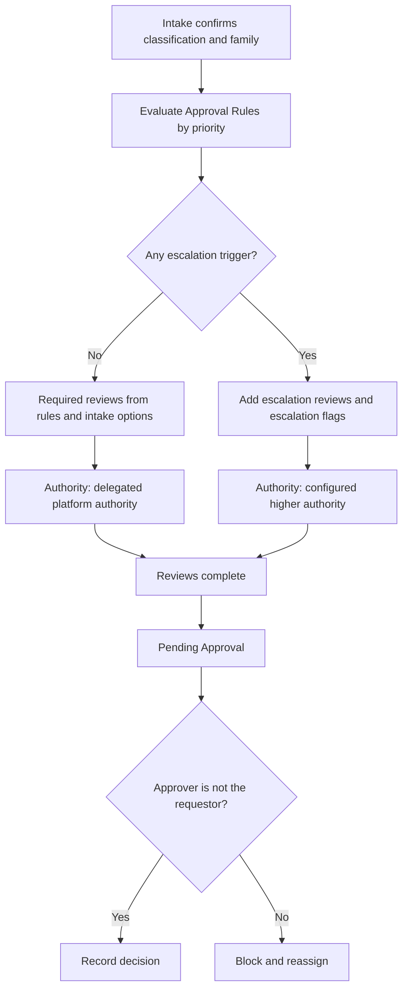

# 05. Security Roles and Approval Routing

Covers deliverables 11 (security-role matrix) and 12 (approval-routing matrix).

## 11. Security-role matrix

### Principles

- Least privilege and separation of duties. Roles are granted to teams where possible, and teams are mapped to Entra security groups (not individual assignment).
- Requestors cannot approve their own requests. Security reviewers cannot approve their own implementations. Developers do not receive routine Production administration through this app.
- The requestor role sees only the 10-item request and plain-language status ([03a-requestor-intake.md](03a-requestor-intake.md)). Governance-derived columns are hidden from requestors by form design and by column security where sensitive.
- Role names are labels. The organization may rename them. Logic references teams and role codes, not display names.
- Privilege notation: **C** create, **R** read, **W** write, **D** delete, **A** append, **AT** append to, **As** assign, **S** share. Scope: **U** user, **BU** business unit, **PBU** parent-child business units, **Org** organization. None = no access.
- No role has Delete on transactional governance tables. Deactivation is used. Only the Platform Administrator holds Delete on configuration tables, and only for unused rows.

### Roles and responsibilities

| # | Role | Purpose | Approval authority | Sensitive-field access | Prohibited actions |
|---|---|---|---|---|---|
| 1 | Requestor | Create and track own requests | None | None. Sees 10-item request fields only | Approve, review, edit after submission except when returned, view other requestors' requests, see classification detail or security columns |
| 2 | Business Owner | Accept accountability, answer impact question, accept handoff | Approves own-organization retirement and handoff. No request approval | Read business justification, owners | Approve a request they submitted, edit reviews |
| 3 | Technical Owner | Provide technical detail, support plan, accept handoff | None | Read technical records for their requests | Approve, review, edit security outcomes |
| 4 | Data Owner | Approve use of governed data, retirement data disposition | Data-owner approval on retirement and data conditions | Read data-related fields | Approve a request |
| 5 | Command or Program Reviewer | Validate mission need and organizational priority | Command or program review recommendation | Read request, owners | Approve platform decisions, edit classification confirmations |
| 6 | Licensing and Capacity Reviewer | Licensing and capacity review | Licensing and capacity outcomes | Read and write licensing and capacity. Read funding owners | Approve a request, edit security |
| 7 | Security Reviewer | Security and authorization review | Security review outcome. Closure approval for security findings | Read and write security requirement, break-glass and service-account columns, authorization boundary | Approve own implementation, approve a request, edit configuration |
| 8 | Connector and DLP Reviewer | Connector and DLP review | Connector decisions and DLP review outcome | Read and write requested connector and integration assessment | Approve a request, edit security outcomes |
| 9 | Platform Intake Analyst | Intake validation, confirm classification and family, route | Intake acceptance, return for information. No final approval except where delegated | Read and write intake fields and derived columns | Approve escalated requests, waive mandatory escalation reviews, edit reviewer outcomes |
| 10 | Platform Provisioner | Execute provisioning tasks and validation | None | Read environment configuration. Write provisioning tasks and configuration | Approve, change decisions, edit review outcomes, waive validation gates |
| 11 | Platform Administrator | Administer configuration and the app | Delegated platform authority for standard requests (when assigned) | Configuration tables. Administrative column profile | Approve a request they originated, hold routine Production environment access through this role beyond administration of the app |
| 12 | Governance Board Reviewer | Decide escalated requests and exceptions | Governance Board decision authority | Read most governance columns including security summaries | Approve a request they originated or sponsor |
| 13 | Auditor or Read-Only Reviewer | Inspect evidence and history | None | Read all governance and audit tables. Security columns via audit column profile | Any create, write, or delete |
| 14 | Support Personnel | Look up environments, owners, runbooks | None | Read environment inventory, support plans | Read security or review detail, approve |

### Table privilege matrix

`-` = no access. Scope shown after the privileges. This is the design baseline and is refined in build.

| Table | Requestor | Business Owner | Technical Owner | Data Owner | Cmd/Prog Reviewer | Licensing | Security | Connector/DLP | Intake Analyst | Provisioner | Platform Admin | Gov Board | Auditor | Support |
|---|---|---|---|---|---|---|---|---|---|---|---|---|---|---|
| Environment Request | C R W (own, until submit/returned) U; A AT | R (BU, as owner) ; W (impact answer) | R (as owner) | R (as owner) | R PBU | R PBU | R PBU | R PBU | R W As PBU | R PBU | R W As Org | R Org | R Org | - |
| Requested Environment | C R W (own) | R | R | - | R | R | R | R | C R W | R W | R W | R | R | - |
| Provisioned Environment | R (own) | R | R | R | R | R | R | R | R W | C R W | C R W D(unused) | R | R | R |
| Organization, Program | R Org | R Org | R Org | R Org | R Org | R Org | R Org | R Org | R Org | R Org | C R W D Org | R Org | R Org | R Org |
| Stakeholder Assignment | C R W (own request) | R W (own) | R W (own) | R | R | R | R | R | C R W | R | C R W | R | R | R |
| Stakeholder Role | R | R | R | R | R | R | R | R | R | R | C R W D | R | R | R |
| Application | C R W (own) | R | R W | R | R | R | R | R | C R W | R | C R W | R | R | R |
| Application and Data Classification | R | R | R | R | R | R | R | R | R | R | C R W D | R | R | R |
| Connector, DLP Policy | R | R | R | R | R | R | R | C R W | R | R | C R W D | R | R | R |
| Requested Connector, External Integration | C R W (own, before review) | R | C R W | R | R | R | R | C R W | C R W | R | R W | R | R | - |
| Licensing Requirement, Capacity Estimate | R | R | C R W (scale input) | - | R | C R W | R | R | R | R | R W | R | R | - |
| Security Requirement | R (summary only) | - | C R W (input) | - | - | - | C R W | R | R (summary) | - | R | R | R | - |
| Authorization Boundary | R (names) | R | R W | - | R | - | C R W | R | R | R | R W | R | R | - |
| Support and Sustainment Plan | R | C R W | C R W | R | R | - | R | - | R | R | R W | R | R | R |
| Review Requirement | - | - | - | - | R | R | R | R | C R W | R | C R W | R | R | - |
| Governance Review | R (status only, filtered) | - | - | - | C R W (cmd/prog review) | C R W (own type) | C R W (own type) | C R W (own type) | C R W | R | C R W | C R W | R | - |
| Approval Decision | R (outcome only) | - | - | - | - | - | - | - | C R (delegated) | - | C R (delegated) | C R | R | - |
| Governance Exception | R (own request) | R | R | - | R | - | R | C R W | C R W | R | C R W | C R W | R | - |
| Provisioning Task | R (status) | - | R | - | - | - | - | - | R | C R W | C R W | R | R | R |
| Environment Configuration | - | - | R | - | - | - | R | R | R | C R W | C R W | R | R | R (limited) |
| Lifecycle Review and Items | - | R | R W | R | R | R W | R W | R W | R | R | C R W | R | R | - |
| Finding | R (own, summary) | R (own) | R W (own) | - | R | R W | C R W | C R W | C R W | C R W | C R W | R | R | - |
| Environment Change Request | C R W (own env) | R | C R W | R | R | R | R | R | R W | R | C R W | R | R | - |
| Retirement Request and Checklist | C R | R W (approval) | R W (approval) | R W (approval) | R | - | R W (when required) | - | R W | C R W | C R W | R | R | - |
| Supporting Document | C R (own) | C R | C R | C R | C R | C R | C R | C R | C R | C R | C R W | R | R | R (support docs) |
| Request History Entry | R (own, filtered) | R | R | - | R | R | R | R | C R | C R | C R | R | R | - |
| Organization Configuration, Family, Type, Approval Rule, Notification Rule, Naming Standard, Review Type, Task Template, Intake Option, Number Sequence | - | - | - | - | R | R | R | R | R | R | C R W D | R | R | - |

Notes:
- Requestor visibility of Governance Review, Approval Decision, and Request History is through filtered views and form design that expose status, decision outcome, and questions only. Internal reviewer notes are in columns hidden from Requestor by column security or form design.
- Number Sequence write is restricted to the automation identity, not any human role.
- Request History Entry: Create only for all roles that create entries. Nobody has Write or Delete.
- Business unit scoping (BU, PBU) is used when one deployment serves several organizations (decision D9).

### Column security profiles

| Profile | Columns | Granted to |
|---|---|---|
| Security Detail | Break-glass, service-account exception, production access, unresolved findings, security finding descriptions, Security Requirement detail | Security Reviewer, Governance Board Reviewer, Platform Administrator, Auditor |
| Authorization Detail | Authorization boundary identifiers and security POC fields | Security Reviewer, Platform Administrator, Auditor, Platform Intake Analyst (read) |
| Funding Detail | License funding owner and funding organization | Licensing and Capacity Reviewer, Platform Administrator, Auditor |
| Stakeholder Contact | `ppg_contactemail` on Stakeholder Assignment | Platform Intake Analyst, Platform Administrator |
| Exception Justification | Justification and compensating controls for security-type exceptions | Security Reviewer, Governance Board Reviewer, Auditor |

### Separation-of-duties enforcement

| Rule | Enforcement |
|---|---|
| Requestor cannot approve, review, or close findings for their own request | Pre-operation plug-in compares actor to request requestor and owners |
| Security reviewer cannot approve their own implementation | Plug-in prevents a user who performed provisioning tasks or is the technical owner from being the security reviewer or closure approver on the same request |
| Finding owner cannot be the closure approver | Plug-in |
| Approver is not the requestor | Plug-in on Approval Decision create |
| Provisioner cannot waive a validation gate | Role design: no write on Review Requirement waivers or decisions |
| Developers do not receive routine Production admin through the app | Provisioner and Platform Administrator roles are not granted to development teams. The app does not grant Production environment access |
| Role assignment is group-based | Teams mapped to Entra groups. Direct user role assignment is exceptional and audited |
| Mandatory escalation reviews cannot be waived by intake | Waiver privilege on Review Requirement excludes escalation-basis rows |

## 12. Approval-routing matrix

Approval Rules ([config-reference.md](04-data-model/config-reference.md)) implement this matrix. The rules are data, evaluated in priority order after intake confirms classifications and family. Authority names and thresholds are organization-configured.

**Standard path:** requests with no escalation trigger may be approved by the **delegated platform authority** (Platform Administrator or a configured team).

**Escalation:** any matched escalation trigger routes the decision to the configured higher authority, adds the required review, and records the reason on the request and the decision.

| # | Trigger | Detected from | Required review added | Decision authority | Notes |
|---|---|---|---|---|---|
| T1 | High-sensitivity or high-impact handling environment | Confirmed data classification flag `requires high-impact handling` | Security | Governance Board (plus security authority concurrence) | IL5-designated in the seed example |
| T2 | CUI or other sensitive information | Data classification `is sensitive` | Security | Escalated authority per configuration | |
| T3 | DLP exceptions | Governance Exception of type DLP, or Requested Connector exception required | Connector and DLP | Governance Board | |
| T4 | High-risk connectors | Connector `is high risk` | Connector and DLP, Security | Governance Board | |
| T5 | Custom connectors | Intake option Custom connector or API, or Requested Connector type Custom | Connector and DLP, Security | Governance Board | |
| T6 | External-facing capabilities | External-facing flag, integration flag, Power Pages option | Security, Connector and DLP | Governance Board | |
| T7 | AI or agent capability using mission or sensitive data | AI flag and data classification rank above configured level | Security, Governance | Governance Board | |
| T8 | Enterprise architecture exceptions | Architecture exception flag | Governance | Governance Board | |
| T9 | New Shared Services Production capability | Family is shared and type is production class | Governance, Licensing and Capacity | Governance Board | Family and type identified by configuration flags |
| T10 | Cross-program shared data integration | Cross-program flag on request or integration | Governance, Security | Governance Board | |
| T11 | New or changed authorization boundaries | Authorization Boundary existing-or-new = New or Changed | Security | Governance Board with security authority | |
| T12 | Break-glass or exception-based operational requirements | Security Requirement break-glass or service-account exception | Security | Governance Board | |
| T13 | Classification not supported | Data classification `is not supported` | Governance | Human decision, no auto-routing to approval | The request is not auto-rejected |
| T14 | Capacity above threshold | Capacity estimate above Organization Configuration threshold | Licensing and Capacity | Escalated authority per configuration | |
| T15 | Premium or Dataverse capability | Capability option | Licensing and Capacity | Delegated authority unless other trigger | Not an escalation by itself |
| T16 | Program Core recommended | Program Core recommendation | Governance (enterprise architecture) | Authorized reviewer decides | Recommendation only |

Triggers T1 to T12 are the specification's escalation list. T13 to T16 are additions for completeness. The organization decides which are active and at what authority.

### Decision options and required data

| Decision | Rationale | Conditions | Expiration or review date | Other |
|---|---|---|---|---|
| Approve | Optional | - | - | |
| Approve with conditions | Required | Required | Required | Condition tracking record. Reminders |
| Reject | Required | - | - | Terminal. Resubmit as a new request |
| Return for information | Required | - | - | Names the stage to return to and the specific question for the requestor |
| Withdraw | Required | - | - | Requestor only |
| Cancel | Required | - | - | Authorized role |

Every decision records: decision authority, individual approver, decision date, rationale, conditions, expiration, related review, related exception, and evidence links (Supporting Document).

### Routing evaluation order

