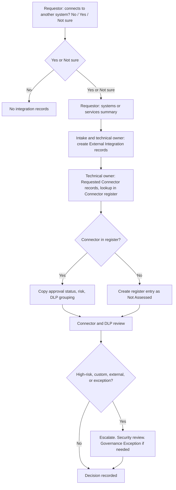

# 06. Rules: Recommendations, Connector Assessment, and Validation

Covers deliverables 13 (environment recommendation rules), 14 (connector and integration assessment design), and 17 (business rules and validation catalog).

Rules recommend and validate. Humans decide. No rule auto-approves or auto-rejects.

## 13. Environment recommendation rules

### 13.1 Classification derivation

Detailed in [03a-requestor-intake.md](03a-requestor-intake.md).

| Rule | Inputs | Output |
|---|---|---|
| RR-01 Recommended data classification | Selected Data Type options | Highest-rank Minimum Data Classification. Pending if an unknown option is selected and nothing is confirmed |
| RR-02 Recommended application classification | Impact answer, capability flags | Suggested application classification. Flags can raise, never lower |
| RR-03 Effective governance rank | Confirmed (or recommended) application and data ranks | The greater rank. Conservative default if neither exists |
| RR-04 Not-supported data | Data classification `is not supported` | Warning and human decision task. Never auto-reject |
| RR-05 Required reviews | Intake Option triggers and Approval Rules | Review Requirement records after intake confirmation |
| RR-06 Escalation flags | Capability options, intake and review flags | Escalation reasons and required authority |

The more restrictive requirement controls routing and required reviews: `effective rank = max(application rank, data rank)`, and rules key on the effective rank and the individual flags.

### 13.2 Family and stage recommendation

| Rule | Logic |
|---|---|
| RR-10 Recommended family | Suggested Family of the selected Workload Type. Approval Rules may override |
| RR-11 Default stage set | Environment Types in the confirmed family with Default Included = Yes become Requested Environment records |
| RR-12 Optional stages | Environment Types marked Optional (for example Program Core) are added only with a justification |
| RR-13 Production predecessor | A production-class stage requires its predecessor type (Test) to be validated first. Enforced at provisioning |
| RR-14 Individual and Default families | These families have a single stage. Elevated governance flags (sensitive data, external-facing, premium) produce a warning recommending a different family |

Seed example (organization-configurable): Platform, Shared Services, Command Hub (Development, Test, Production), Program (optional Core, Development, Test, Production), Individual Developer (single), Default (single).

### 13.3 Program Core recommendation

Program Core is optional. It is considered only when architectural requirements justify separating shared foundational components from application-level development. It is **not** recommended solely because an application is important, mission-critical, or long-lived. The rule suggests. An authorized reviewer decides and records a rationale (required if the decision differs from the recommendation).

Indicators (asked in technical assessment, answered by the technical owner or the intake analyst). Mission impact and longevity are deliberately not indicators.

| Code | Indicator |
|---|---|
| PC-1 | Multiple development teams working against a common architecture |
| PC-2 | Multiple applications sharing a common Dataverse data model |
| PC-3 | Shared Dataverse tables, relationships, security components, or foundational components |
| PC-4 | Complex Dataverse schema requiring centralized stewardship |
| PC-5 | Shared components needing release management independent of application release cycles |
| PC-6 | Separation of schema ownership from application-development responsibilities |
| PC-7 | Need to prevent uncontrolled modification of shared schema in Program Development |

Recommendation logic (thresholds are an organization decision, D8):

| Condition | Recommendation |
|---|---|
| Family is not Program | Not applicable |
| Number of architectural indicators selected is at or above the configured threshold, or any configured "decisive" indicator (for example PC-3 or PC-6) is selected | Recommended |
| One or more indicators selected below the threshold | Insufficient Information, with a prompt for the missing detail |
| No indicators selected | Not Recommended |
| Only mission-critical, importance, or longevity signals present | Not Recommended (shown with the reason) |

The recommendation, the indicators that drove it, and the reviewer decision are stored on the request. See Environment Request columns in [04-data-model/request.md](04-data-model/request.md).

### 13.4 Warning rules

| Warning | Condition |
|---|---|
| W-01 Sensitive data in a low-governance family | Sensitive data type with Individual Developer or Default family |
| W-02 External-facing in a shared stage | External-facing with Default family |
| W-03 AI with sensitive data | AI flag with sensitive data |
| W-04 Temporary duration without end date | Duration is Temporary and end date is empty |
| W-05 Classification differs from recommendation | Confirmed classification is lower than recommended (requires triage notes) |
| W-06 Unknown answers outstanding | Any unresolved unknown answer when intake attempts to generate reviews |

## 14. Connector and integration assessment design

### Flow

### Connector register (reference)

Maintained by the Connector and DLP Reviewer. Each connector has type (Standard, Premium, Custom, Other), publisher, risk level, high-risk flag, approval status, default DLP grouping, authentication model, service-principal support, endpoint exposure, premium-license requirement, and availability in the target cloud (**GCV**). The high-risk definition is an organization decision (D5).

### Requested Connector assessment (per request)

| Assessment attribute | Source | Evaluated by |
|---|---|---|
| Connector name, type, publisher | Register or entered | Connector and DLP reviewer |
| Data sources, destination | Technical owner | Reviewer |
| Authentication model, service-principal support | Register, then technical owner | Reviewer, security reviewer |
| Data residency | Technical owner | Security reviewer |
| Endpoint exposure | Register, then technical owner | Reviewer |
| Data classification | Request or integration | Reviewer |
| DLP grouping (business, non-business, blocked) | Register default, request value | Reviewer |
| Existing approval status | Register | System |
| Requested stages | N:N to Requested Environment | System |
| Licensing impact | Premium flag in register | Licensing reviewer |
| Authorization impact | Boundary change detection | Security reviewer |
| Security review required | Rule recommendation | Security reviewer confirms |
| Exception required | Reviewer | Reviewer, creates Governance Exception |
| Decision and expiration | Reviewer or Governance Board | Approval authority |

### Connector decision rules

| Condition | Recommendation |
|---|---|
| Register status Approved, not high-risk, DLP grouping compatible | Recommend Approve. No escalation |
| Approved with Conditions | Recommend Approve with Conditions and carry the register conditions and expiry |
| Not Assessed | Recommend assessment. Review cannot complete until the register is updated |
| High-risk or Restricted | Escalate. Security review required |
| Blocked | Recommend Reject or exception path. Cannot proceed without a Governance Exception |
| Custom connector | Escalate. Security review required. Capture owning team and support |
| Endpoint exposure External | Escalate |

### External Integration assessment

Captured attributes (17): source system, target system, direction, data exchanged, data classification, endpoint, hosting boundary, authentication method, expected frequency or volume, availability requirement, owning organization, technical owner, authorization boundary, connector or custom connector dependency, gateway dependency, monitoring requirement, and support responsibility. Plus flags for cross-program, external-facing, and custom connector use.

Checks: no credentials or tokens in free text. Endpoint is a hostname or URL only. Authorization boundary is required if data classification is sensitive. Unowned integrations (no owning organization or technical owner) cannot complete assessment. A gateway dependency is flagged **GCV**.

## 17. Business rules and validation catalog

Layers: **BR** = form business rule (client and server), **PI** = synchronous plug-in, **BPF** = process-stage requirement, **FL** = cloud flow, **VW** = view or dashboard control.

| ID | Rule | Spec reference | Layer | When enforced |
|---|---|---|---|---|
| BV-01 | The 10 intake items are required to submit. "Unknown" answers are valid | Simple upfront request | PI, BR | Submit |
| BV-02 | Business Owner and Technical Owner required before submission | Owners | PI | Submit |
| BV-03 | Temporary duration requires an expected end date | Intake | BR, PI | Submit |
| BV-04 | Systems or services summary required when Connects to Other Systems is Yes | Intake | BR | Submit |
| BV-05 | Data Owner required when data types or confirmed data classification indicate governed data | Data owner | PI | Review generation |
| BV-06 | Security reviewer required for sensitive-data requests | Security | Rule (Review Requirement) | Review generation |
| BV-07 | Authorization information required for CUI and other sensitive workloads | Authorization | PI | Security review exit |
| BV-08 | Connector records required when integrations are requested | Connectors | PI | Technical assessment exit |
| BV-09 | Licensing review required for premium capabilities | Licensing | Rule | Review generation |
| BV-10 | Capacity review required for Dataverse environments | Capacity | Rule | Review generation |
| BV-11 | Classifications and family must be confirmed before reviews are generated | Intake design | PI | Review generation |
| BV-12 | Support plan required before Production approval | Support | PI | Approval decision |
| BV-13 | Production cannot be provisioned before required Test validation | Provisioning | PI | Task start |
| BV-14 | Rejection and return decisions require rationale | Approval | PI | Decision create |
| BV-15 | Conditional approval requires conditions and a review or expiration date | Approval | PI | Decision create |
| BV-16 | Approver is not the requestor | SoD | PI | Decision create |
| BV-17 | Security reviewer cannot be the technical owner or provisioner of the same request | SoD | PI | Review assign |
| BV-18 | Finding owner cannot be the closure approver | SoD | PI | Finding close |
| BV-19 | Closed finding requires closed date and closure approver | Findings | PI | Finding close |
| BV-20 | Risk Accepted finding requires an approved related exception | Findings | PI | Finding status |
| BV-21 | Approved governance exception requires an expiration date | Exceptions | PI | Exception approve |
| BV-22 | Request cannot be marked Completed until Environment records and validation evidence exist, owners accepted handoff, and support and runbook locations are recorded | Completion | PI | Complete |
| BV-23 | Retirement cannot complete before retention and dependency tasks are resolved | Retirement | PI | Retirement complete |
| BV-24 | Request number is immutable and format-validated | Identifier | PI | Create, update |
| BV-25 | No secrets, passwords, certificates, keys, or tokens in text columns | Security | PI (pattern check), form guidance | Create, update |
| BV-26 | Requested Environment type must belong to the request family | Model | PI | Create |
| BV-27 | Optional stage (for example Program Core) requires justification | Model | BR | Save |
| BV-28 | Confirmed classification lower than recommended requires triage notes | Intake design | PI | Intake confirm |
| BV-29 | Program Core decision that differs from recommendation requires rationale | Program Core | PI | Save |
| BV-30 | Not-supported data classification cannot proceed to Pending Approval without a recorded human decision | Classification | PI | Status change |
| BV-31 | A mandatory escalation review cannot be waived by Platform Intake Analyst | Routing | PI | Waive |
| BV-32 | Stakeholder Assignment has exactly one of User or Contact | Model | PI | Save |
| BV-33 | Request cannot move to Pending Approval while any required review is open | Process | PI | Status change |
| BV-34 | Requestor cannot be changed after submission | SoD | PI | Update |
| BV-35 | Validation tasks with result Fail block Completed | Validation | PI | Complete |

Business rules (BR) run on forms for usability. Anything that protects governance integrity is also enforced server-side (PI) so API and flow access cannot bypass it.
