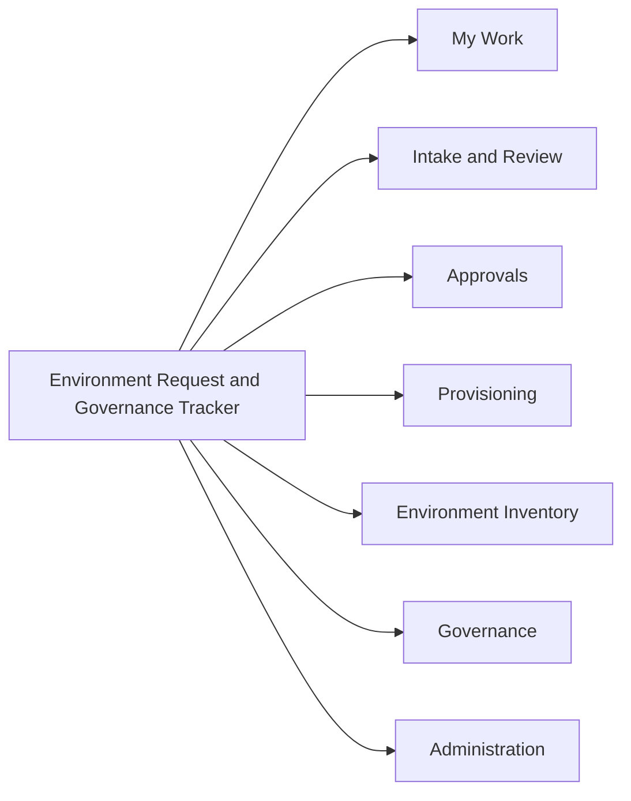

# 07. Model-Driven App Design

Covers deliverable 15: forms, views, charts, dashboards, and sitemap.

App name: **Power Platform Environment Request and Governance Tracker** (unique name `ppg_environmentgovernanceapp`). Navigation labels use the configured terminology from Organization Configuration where practical (for example, the security authority label).

## Sitemap

| Area | Subarea | Table and view | Visible to |
|---|---|---|---|
| **My Work** | My Draft Requests | Environment Request, active Draft, owned by me | Requestor, owners |
| | My Submitted Requests | Environment Request, submitted by me | Requestor |
| | Requests Requiring My Action | Returned for Information, review assignments, approvals, tasks, owner acceptance | All |
| | My Environments | Provisioned Environment where I am a stakeholder | Owners, Support |
| **Intake and Review** | New Requests | Environment Request, Submitted | Intake Analyst |
| | Intake Queue | Environment Request, Intake Validation, with unresolved unknowns flag | Intake Analyst |
| | Governance Reviews | Governance Review, type Governance and Command or Program | Reviewers |
| | Security Reviews | Governance Review, type Security | Security Reviewer |
| | Licensing and Capacity Reviews | Governance Review, type Licensing | Licensing Reviewer |
| | Connector and DLP Reviews | Governance Review, type Connector and DLP | Connector and DLP Reviewer |
| | Returned Requests | Environment Request, Returned for Information | Intake Analyst |
| **Approvals** | Pending Decisions | Environment Request, Pending Approval | Platform Admin, Gov Board |
| | Conditional Approvals | Approval Decision, Approve with Conditions, Open | Platform Admin, Gov Board |
| | Rejected Requests | Environment Request, Rejected | Platform Admin, Gov Board, Auditor |
| | Expiring Exceptions | Governance Exception, expiring within configured window | Gov Board, Security |
| **Provisioning** | Approved Requests | Environment Request, Approved or Approved with Conditions | Provisioner |
| | Provisioning Queue | Requested Environment, Approved or Provisioning | Provisioner |
| | Provisioning Tasks | Provisioning Task, open | Provisioner |
| | Validation and Handoff | Provisioning Task, Validation and Handoff categories | Provisioner, Owners |
| **Environment Inventory** | All Environments | Provisioned Environment | All internal roles |
| | Platform, Shared Services, Command Hub, Program, Individual Developer | Provisioned Environment filtered by family (views are generated from the family configuration, not hard-coded names) | All internal roles |
| | Environments Due for Review | Next Review Due within window | Platform Admin, Owners |
| | Environments Recommended for Retirement | Retirement Recommended = Yes | Platform Admin |
| **Governance** | Exceptions | Governance Exception | Gov Board, Security, Auditor |
| | Findings | Finding | Security, Platform, Auditor |
| | Lifecycle Reviews | Lifecycle Review | Platform Admin, Owners |
| | Connector Register | Connector | Connector and DLP Reviewer |
| | DLP Policies | DLP Policy | Connector and DLP Reviewer |
| | Authorization Boundaries | Authorization Boundary | Security |
| **Administration** | Organizations | Organization, Program or Command | Platform Admin |
| | Environment Families, Environment Types | Reference | Platform Admin |
| | Classifications | Application Classification, Data Classification | Platform Admin |
| | Intake Options | Intake Option | Platform Admin |
| | Approval Rules | Approval Rule | Platform Admin |
| | Naming Standards | Naming Standard | Platform Admin |
| | Notification Rules | Notification Rule | Platform Admin |
| | Review Types, Task Templates, License Types | Reference | Platform Admin |
| | Configuration | Organization Configuration | Platform Admin |

Sitemap groups are secured by role so each persona sees only their areas. A requestor sees **My Work** only (plus New Request).

## Main table experiences

### Environment Request

| Item | Design |
|---|---|
| Quick-create form (requestor) | The 10 intake items with conditional visibility: title, program or command, business justification, business owner, technical owner, data types, estimated users, capabilities, connects to another system (and summary), workload type (and recommended family), duration (and end date). This is also the requestor's main form |
| Main form (internal roles) | Tabs: **Summary** (BPF header, request number, status, stage, owners, key flags), **Request** (the 10 items, read-only after submit), **Intake and Classification** (recommended and confirmed classifications, family, impact answer, triage notes, unknown-answer panel), **Reviews** (Review Requirement and Governance Review subgrids), **Technical** (Application, Requested Environment, Requested Connector, External Integration subgrids, Program Core panel), **Licensing and Capacity**, **Security and Authorization** (Security Detail profile only), **Support Plan**, **Decisions and Exceptions**, **Provisioning**, **Documents**, **History** (Request History timeline) |
| Requestor form | Hides Intake and Classification, Reviews, Security, Licensing, Decisions internals. Shows plain-language status, the question returned for information with a reply control, decision outcome, conditions, and next step |
| Views | My Draft Requests, My Submitted Requests, New Requests, Intake Queue, Returned for Information, By Stage, Pending Approval, Approved or Approved with Conditions, Rejected, Escalated Requests, Requests With Unresolved Unknown Answers, Overdue Requests, Completed, All Requests |
| Charts | Requests by stage, by status, by family, by organization, by effective rank, approval outcomes, average time in stage |
| Dashboard | Intake and Pipeline (see below) |
| Subgrids | As listed on the Technical, Reviews, and Provisioning tabs |
| Business rules | Show systems summary when connects is Yes or Not Sure. Require end date when Temporary. Show Data Owner when data types prompt it. Show authorization question per rules. Lock request items after submit. Hide governance columns from Requestor |
| Command bar | Submit (validates and lists failures), Resubmit, Withdraw, Return for Information, Accept for Intake, Confirm Classification and Family, Generate Reviews, Record Decision, Add Exception, Generate Provisioning Tasks, Mark Completed (guarded), Create Change Request, Print Summary |
| Conditional visibility | Support Plan tab prominent when a production-class stage is requested. Security tab only when security review is required and the user has the Security Detail profile. Program Core panel only when the family is Program |
| Required by stage | Per [03-process.md](03-process.md) stage definitions and [06-rules.md](06-rules.md) validation catalog |

### Requested Environment

Quick-create: type (filtered to family), required, justification. Main form: proposed name, region, status, linked connectors (N:N subgrid), capacity estimate, tasks, provisioned environment. Views: by request, provisioning queue, optional stages included. Command bar: Include or Exclude optional stage, Generate Name.

### Governance Review

Main form: review type, requirement, reviewer, status, outcome, recommendation, rationale, conditions, findings, documents. Quick-create for review assignment. Views by type (Security, Licensing, Connector and DLP, Governance), My Reviews, Overdue Reviews, Escalated Reviews. Charts: reviews by type and status, average completion time. Command bar: Start, Complete, Return for Information, Escalate, Create Finding, Create Exception. Business rules: require rationale for Unsatisfactory, Escalate, Return. Reviewer cannot be requestor.

### Approval Decision

Main form: decision, authority, approver, date, rationale, conditions, expiration, related review and exception, evidence. Created only through the Record Decision command (dialog). Read-only after creation. Views: Pending Decisions, Conditional Approvals Open, Decisions by Authority, Superseded. Chart: outcomes.

### Governance Exception

Main form: type, justification, compensating controls, risk owner, dates, status, renewals. Views: Active, Expiring Soon, Expired, By Type. Chart: expiring by month. Command bar: Request Renewal, Revoke, Close.

### Provisioned Environment

Main form: identity, family and type, owners (stakeholder subgrid), classifications, DLP, boundary, support plan, state, review dates, tabs for Configuration, Tasks, Lifecycle Reviews, Findings, Changes, Retirement, Exceptions, Documents. Views: All Environments, by family (generated), by organization, by classification, Due for Review, Ownerless, Recommended for Retirement, Retired. Charts: by family and type, organization, classification, review status. Command bar: Start Lifecycle Review, Create Change Request, Start Retirement, Validate Owners.

### Provisioning Task

Main form: category, sequence, execution mode, status, result, assignee, evidence, notes, automation dependency (shown with a **GCV** flag). Quick-create for ad-hoc tasks. Views: My Tasks, Provisioning Queue, Blocked, Validation Tasks, Handoff Pending. Command bar: Start, Complete (evidence check), Fail, Mark Not Applicable.

### Finding

Main form: type, severity, source, description, scope, owner, due date, status, remediation plan, closure. Views: Open by Severity, My Findings, Overdue, Awaiting Closure Approval. Charts: open by severity, by source, aging.

### Lifecycle Review, Environment Change Request, Retirement Request

Lifecycle Review: items subgrid (22 areas, generated from a template), outcome, summary. Change Request: environment, change type, description, triggers re-review, linked review request. Retirement Request: reason, approvals (business, technical, data), disposition, checklist subgrid (12 items), Complete command guarded by BV-23.

### Support and Sustainment Plan, Security Requirement, Licensing, Capacity, Connectors, Integrations

Each has a main form grouped to match the data dictionary, a read-only summary card on the request, and views by status. Security Requirement uses the Security Detail column profile.

### Administration tables

Standard main forms with Active and Inactive views. Alternate-key fields are locked after creation. The Approval Rule form includes a "Preview matches" dialog to test a sample request against rules.

## Dashboards

| Dashboard | Audience | Tiles |
|---|---|---|
| Intake and Pipeline | Intake Analyst, Platform Admin | New requests, intake queue, requests by stage, unresolved unknown answers, returned, overdue |
| My Work | Everyone | My drafts, returned for information, actions waiting on me, my environments |
| Reviews | Reviewers | My reviews, overdue reviews by type, escalated reviews |
| Approvals | Gov Board, Platform Admin | Pending decisions, conditional approvals, expiring exceptions, outcomes |
| Provisioning | Provisioner | Backlog, tasks by status, blocked tasks, validation and handoff pending |
| Inventory and Lifecycle | Platform Admin | Environments by family and type, by organization, by classification, due for review, ownerless, retirement recommended |
| Governance and Findings | Security, Auditor | Open findings by severity, exceptions by type and expiry, connector requests by risk |
| Demand | Licensing and Capacity, Platform Admin | Licensing demand, capacity demand |

Dashboards are native Dataverse charts for MVP. Advanced analytics (average time in stage, trends) are in [09-audit-reporting.md](09-audit-reporting.md) and may use Power BI later (**GCV** for the Power BI service in the target cloud).

## Accessibility and usability notes

- Use standard model-driven controls. Avoid PCF controls unless tested with keyboard and screen readers.
- Plain-language labels on the requestor form. Help text comes from Intake Option.
- Do not rely on color alone for status or severity. Include a text label.
- Limit subgrid rows on the main form. Provide "View all" links.
