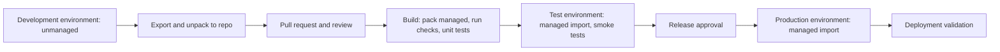

# 10. ALM, Solution Architecture, and Government-Cloud Dependencies

Covers deliverables 20 (ALM and solution architecture) and 21 (government-cloud availability dependencies requiring validation).

## 20. ALM and solution architecture

### Recommendation: layered managed solutions

Use **separate managed solutions in a one-way dependency order**, not a single monolith and not many unrelated solutions. (See ADR 0002.)

| Layer | Solution (unique name) | Contents | Depends on |
|---|---|---|---|
| 1 | Core Data Model (`ppg_core`) | Tables, columns, relationships, global choices, alternate keys, auditing settings | None |
| 2 | Reference and Configuration (`ppg_config`) | Configuration and reference table forms and views, environment variable definitions, option sets. **No organization seed data** | 1 |
| 3 | Request Management (`ppg_requests`) | Request, Requested Environment, Stakeholder Assignment, Application, intake forms and views, BPF | 1, 2 |
| 4 | Reviews and Approvals (`ppg_reviews`) | Review, Review Requirement, Approval Decision, Exception, Finding forms and views | 1, 2, 3 |
| 5 | Provisioning and Inventory (`ppg_provisioning`) | Provisioned Environment, Provisioning Task, Environment Configuration forms and views | 1, 2, 3, 4 |
| 6 | Lifecycle and Retirement (`ppg_lifecycle`) | Lifecycle Review, Change Request, Retirement forms and views | 1, 2, 5 |
| 7 | Automation (`ppg_automation`) | Plug-in assembly and steps, cloud flows, connection references | 1 to 6 |
| 8 | Model-Driven App (`ppg_app`) | App module, sitemap, security roles, column security profiles, dashboards | 1 to 7 |
| 9 | Reporting (`ppg_reporting`) | Charts, dashboards, report definitions, later Power BI | 1 to 8 |

Tables that span domains (Provisioned Environment links to Request, Review, Finding) live in the lowest layer that all dependents need. In practice layer 1 owns all table definitions and later layers own forms, views, and logic. This avoids circular dependencies.

Seed data (USMC example) ships as a separate **configuration data package** (`seed/`), imported by the configuration data tool or a scripted upsert using alternate keys. It is not inside a solution.

### Why layered

| Benefit | Detail |
|---|---|
| Independent versioning | Rules and UI change more often than schema |
| Smaller deployments | Faster import, lower risk |
| Separation of concerns | Schema, config, logic, and UI are owned and tested separately |
| Reuse | Another organization can reuse layers 1 to 8 and replace the seed package |

### Trade-off

More solutions mean more dependency management and import-order discipline. A single solution would be simpler to start, but harder to maintain. Layers 1 and 2 may be combined for MVP if import order proves troublesome. This decision is revisited at the end of the scaffold phase.

### Source control

| Item | Approach |
|---|---|
| Repository | https://github.com/DevonAleshireMSFT/dow-pwr-plat-gov-app |
| Layout | `solutions/<name>/` unpacked with PAC CLI (`pac solution unpack`). `src/plugins/` for plug-in source. `seed/` for configuration data. `docs/` for design. `.ai/` for context and ADRs |
| Branching | `main` is always deployable to Test. Short-lived feature branches and pull requests. Pull request review required |
| Commits | Unpacked solution diffs reviewed. Do not commit managed artifacts or environment-specific values |
| Secrets | None in the repository. Environment variables of the secret type are populated in each environment from the approved vault |

### Pipeline

| Stage | Activities |
|---|---|
| Develop | Work in an unmanaged dev environment with a dedicated publisher. Use a dedicated solution per layer |
| Export and unpack | `pac solution export` and `unpack` on the solution. Commit the result |
| Check | Solution checker (static analysis). Static scan for forbidden literals (organization names, secrets) to protect the generalization rule (NFR-09) |
| Build | `pac solution pack` as managed. Plug-in unit tests. Version stamp |
| Deploy to Test | Import managed. Set environment variables and connection references from the deployment settings file. Import seed data (test dataset) |
| Test | Smoke test: create request, submit, intake confirm, review generation, decision, task generation. Security-role tests using test users per role. Accessibility check |
| Deploy to Production | Managed import with deployment settings. No manual changes in Production |
| Deployment validation | Checklist below |
| Rollback | Prior managed version retained. Documented rollback steps. Data backup before release. Seed data changes are scripted and reversible. Plug-in assembly rollback is a solution version rollback |

### Deployment validation checklist

| # | Check |
|---|---|
| 1 | Solution versions match the release manifest |
| 2 | Environment variables have values (no placeholders) |
| 3 | Connection references are connected to the service identity, not a personal account |
| 4 | Flows are on and owned by the service identity |
| 5 | Plug-in steps are registered and enabled under the application user |
| 6 | Security roles and column security profiles exist and are mapped to teams |
| 7 | Organization Configuration exists and is active, and Number Sequence rows exist |
| 8 | Seed or configuration data imported and alternate keys resolve |
| 9 | Auditing enabled on governed tables |
| 10 | Smoke-test request completes the path to review generation |
| 11 | Monitoring and alerting targets are configured |

### Environment variables and connection references

| Name | Type | Purpose |
|---|---|---|
| `ppg_SharePointSiteUrl` | Text | Evidence library site |
| `ppg_SharePointLibraryName` | Text | Library name |
| `ppg_NotificationMailbox` | Text | Shared mailbox for notifications |
| `ppg_PlatformTeamAlertAddress` | Text | Alerts for flow and plug-in failures |
| `ppg_SchedulerEnabled` | Yes/No | Pauses scheduled flows for maintenance |
| `ppg_ReviewLeadDays` | Number | Default lead window. Value is set by the organization |
| `ppg_AdminApiEndpoint` | Text | Administrative API endpoint, for later automation (**GCV**) |
| `ppg_AdminApiClientSecret` | Secret | Later automation only. From an approved vault (**GCV**) |
| Connection references | Dataverse, Office 365 Outlook, SharePoint, Teams (optional), Power Platform for Admins (later, **GCV**) | Bound to the service identity |

### Test strategy (NFR-16, NFR-17)

| Test type | Scope |
|---|---|
| Plug-in unit tests | Request number generation, validation rules BV-xx, derivation RR-xx, separation of duties |
| Rule tests | Approval Rule evaluation against a fixture set of sample requests per trigger T1 to T16 |
| Flow tests | Scheduled flows with fixture data, failure branches |
| Security tests | Each role: allowed and prohibited actions (including requestor cannot approve own request) |
| UI tests | Requestor form shows only the 10 items. Conditional prompts show and hide correctly |
| Configuration tests | Seed package imports cleanly. A non-USMC sample seed also works (proves generalization) |
| Accessibility | Keyboard and screen-reader pass on requestor and reviewer forms |
| Deployment smoke test | Run after each deployment |

### Monitoring

| Signal | Action |
|---|---|
| Flow failures | Alert to the platform team address. Weekly review |
| Plug-in errors | Trace logs reviewed. Alert on repeated errors |
| Overdue reviews and tasks | Dashboard and A17 |
| App health | Environment owner monitors per organization practice |

## 21. Government-cloud availability dependencies requiring validation

Do not assume that commercial Power Platform features, APIs, or administrative capabilities exist in GCC, GCC High, DoD, or IL5 environments. Each item below needs validation by the implementing organization before it is relied on. Mark status as the validation proceeds.

Status values: Not Validated, Validated Available, Validated Unavailable, Workaround Needed.

| # | Dependency | Used by | MVP impact | Fallback if unavailable | Status |
|---|---|---|---|---|---|
| G01 | Dataverse in the target cloud, model-driven apps, business process flows | Entire app | Blocking | None. Prerequisite | Not Validated |
| G02 | Plug-in registration and sandbox execution (custom code) | A01, A02, A03, A05, A09, A16, A20 | High | Reduce to flows and business rules. Weakens enforcement. Needs a design decision | Not Validated |
| G03 | Power Automate cloud flows, connection references, service-principal or service-account ownership | Flows A04 to A19 | High | Manual processes plus plug-in only | Not Validated |
| G04 | Connectors needed: Dataverse, Office 365 Outlook, SharePoint, Teams | Notifications, document links | Medium | Email through Dataverse email or manual notification | Not Validated |
| G05 | Microsoft Teams channel notifications | Notification Rule channel | Low | Email only | Not Validated |
| G06 | SharePoint Online and Dataverse-SharePoint document integration | Supporting Document, evidence | Medium | Link-only Supporting Document records to an approved repository | Not Validated |
| G07 | Power Platform admin center APIs and the Power Platform for Admins connector | Later API-based provisioning (ADR 0003), inventory sync, activity data | Not MVP | Manual provisioning and manual inventory | Not Validated |
| G08 | Managed Environments features | Environment Configuration, validation checks | Medium | Mark task Not Applicable and record the limitation | Not Validated |
| G09 | Power Platform pipelines | Pipeline association checks, ALM | Low | Source-control pipeline (GitHub Actions or equivalent) | Not Validated |
| G10 | DLP policy APIs and tenant settings visibility | DLP verification, connector register sync | Not MVP | Manual DLP assignment and reference records | Not Validated |
| G11 | Environment region identifiers and environment types available in the cloud | Requested Environment region, Environment Type platform mapping | Medium | Free-text value validated by provisioner | Not Validated |
| G12 | Dataverse long-term retention and audit-log export options | Audit retention | Medium | Export to the organization's log repository | Not Validated |
| G13 | Read auditing availability | Audit configuration | Low | Table and column auditing only | Not Validated |
| G14 | Copilot, AI features, and agents in the target cloud | AI trigger rule, any AI assist features | Low | Rules only (no AI assist in the app) | Not Validated |
| G15 | Power BI service and embedded reporting | Later reporting | Not MVP | Native dashboards and Excel export | Not Validated |
| G16 | Environment variables of secret type with Azure Key Vault | Later automation secrets | Not MVP | No secrets stored in the app | Not Validated |
| G17 | Conditional Access and session-control capabilities | Security requirement considerations (record only) | Low | Recorded as requirement, not enforced by the app | Not Validated |
| G18 | On-premises and VNet data gateway support | External Integration gateway dependency (record only) | Low | Recorded as dependency | Not Validated |
| G19 | Capacity add-on and capacity reporting data | Capacity review | Low | Manual capacity data | Not Validated |
| G20 | Modern app designer, command bar customization, and custom pages | App design | Medium | Classic customization alternatives | Not Validated |
| G21 | Service principal (application user) support for plug-ins and flows | Automation identity | High | Dedicated service account with strong controls and approval | Not Validated |
| G22 | Solution checker and PAC CLI against the target cloud | ALM | Medium | Check in a commercial or pre-production environment, then promote | Not Validated |
| G23 | Notification delivery channels (email from Dataverse or shared mailbox) | Notification Rules | Medium | Manual notification | Not Validated |

### Validation procedure

1. For each item, test in a non-production environment inside the target cloud boundary.
2. Record the result, date, and tester in the item status.
3. For items that are Validated Unavailable, apply the fallback and record any resulting gap in the risk register ([11-delivery.md](11-delivery.md)).
4. Re-validate on each major platform release and before enabling a previously deferred capability.

Items marked "Not MVP" are not on the critical path. Items G01 to G03, G21 block or materially change the design and are validated first (a spike in the first phase).
